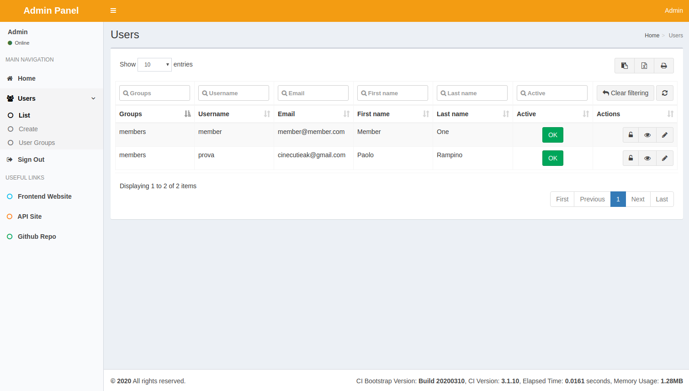
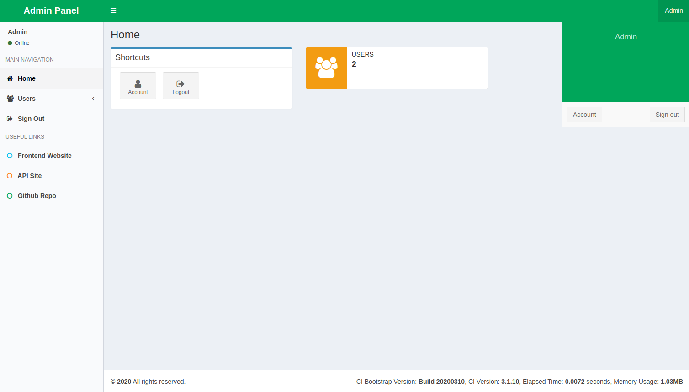
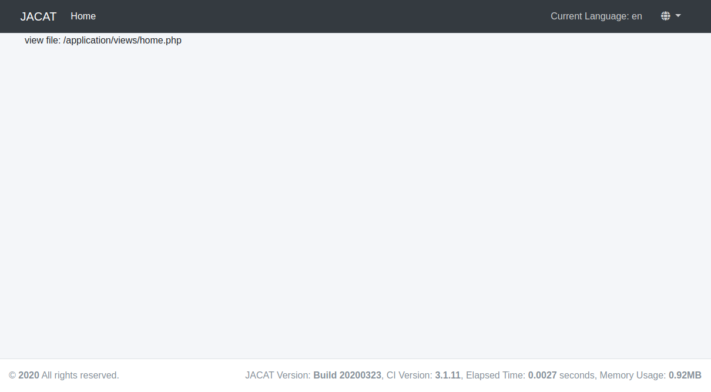

## JACAT (Just Another CodeIgniter/AdminLTE template)

**Latest Build: 2020-03-28**

**Note: This project is still in progress, but welcome for any issues encountered**

A starter template that supports multi-tenant (Frontend / Admin Panel / API) website in a single application. This is a fork of abandoned [CodeIgniter 3 Bootstrap](https://github.com/waifung0207/ci_bootstrap_3). 
If you plan to upgrade form original you have to use [sql/upgrade_from_old_codeigniter_3_bootstrap.sql](sql/upgrade_from_old_codeigniter_3_bootstrap.sql) and also check the changes inside [application/modules/admin/config/ion_auth.php](application/modules/admin/config/ion_auth.php)

This repository is developed upon the following tools: 
* [CodeIgniter](http://www.codeigniter.com/) (3.1.11) - PHP framework
* [CodeIgniter HMVC Extensions](https://bitbucket.org/wiredesignz/codeigniter-modular-extensions-hmvc) - modular structure by [wiredesignz](http://wiredesignz.co.nz/)
* [codeigniter-base-model](https://github.com/jamierumbelow/codeigniter-base-model) - more advanced CRUD functions for models by [jamierumbelow](https://github.com/jamierumbelow)
* [codeigniter-restserver](https://github.com/chriskacerguis/codeigniter-restserver) - base setup for API module
* [Ion Auth](http://benedmunds.com/ion_auth) - (3.0) authentication library for CodeIgniter by [Ben Edmunds](http://benedmunds.com/)
* [Bootstrap](http://getbootstrap.com/) (4.4.1) - popular frontend framework
* [Grocery CRUD](http://www.grocerycrud.com/) (custom based on v1.6.3) - feature-rich library to build CRUD tables
* [Image CRUD](http://www.grocerycrud.com/image-crud) (v0.8) - CRUD library for image management
* [AdminLTE](https://github.com/almasaeed2010/AdminLTE) (3.0.2) - bootstrap theme for Admin Panel


### Features

This repository contains setup for rapid development:
* Multi-tenant (e.g. Frontend Website, Admin Panel, API) website in single application
* Modular design by CodeIgniter HMVC extension
* Custom config files (sites.php, locale.php) for easy configuration of website behavior
* Admin Panel with AdminLTE v3 theme, and Grocery CRUD integration
* Admin Panel includes usage of [Sortable](http://rubaxa.github.io/Sortable/) library
* API Site with [Swagger](http://swagger.io/) UI integrated, via annotations supported by [swagger-php](https://github.com/zircote/swagger-php) library
* API Site to handle RESTful endpoints, with shortcut functions to grab parameters and display results
* User authentication for Frontend Website (Sign Up, Login, Forgot Password, etc.)
* User authentication for Admin Panel (Login, Change Password, etc.)
* Preset layouts and templates
* Preset asset pipeline (e.g. minify scripts, image optimization) via gulp (reference from [gulp-starter](https://github.com/greypants/gulp-starter))
* Preset data structure for Blogging (with pagination) and Cover Photos (carousel), which can be managed from Admin Panel
* Form Builder library to help with form rendering with Bootstrap theme, form validation, etc.
* Breadcrumb and Pagination handling fit with Bootstrap theme
* Custom 404 pages for Frontend Website and Admin Panel
* Multilingual support
* Email config setup
* Functions to be called from CLI (e.g. daily cron job, database backup)
* ... more coming!


### Demo Project

* Coming Soon...


### Server Environment

Below configuration are preferred; other environments are not well-tested, but still feel free to report and issues. 

* **PHP 7.0+**
* **Apache 2.2+** with rewrite mod enabled
* **MySQL 5.5+** (not tested on MariaDB)


### Setup Guide

1. git clone this repo
2. Create a database (e.g. named "jacat"), into MySQL server
3. Inside /application/config/ copy "database.model.php" as "database.php" and make sure that database config is set correctly
4. go to your-new-site/upgrade to install database with new tables and default configuration datas.
5. You should be able to access Frontend Website, Admin Panel and API Site (with Swagger Doc) respectively
6. Visit the Demo Controllers (exist in both Frontend / Admin Panel / API) for sample usage

### Upgrade database from prevoius version
1. go to your-new-site/upgrade to upgrade database tables


### Admin Users (and default login accounts)

There are 4 preset users for Admin Panel:

* Webmaster (default username & password are both "webmaster", belongs to the webmaster group)
* Admin (default username & password are both "admin", belongs to the admin group)
* Manager (default username & password are both "manager", belongs to the manager group)
* Staff (default username & password are both "staff", belongs to the staff group)


### Folder Structure

Explanation on the folder structure which supports HMVC (only showing the highlighted folders and files).

```
application/                    --- Main CodeIgniter source files
    config/
        production/             --- Configuration when ENVIRONMENT is set as "production"
        autoload.php            --- By default, some files are loaded for this repo
        jacat.php               --- Core configuration file for all sites
        database.php            --- Need to verify to ensure connection with MySQL database
        email.php               --- Created to centralize email configuration (default: using Mailgun)
        form_validation.php     --- Created to centralize validation forms for all forms, include ReCAPTCHA settings
        routes.php              --- Changed default controller from Welcome to Home
    controllers/                --- Controllers for Frontend Website; extends from MY_Controller (except Cli)
        Cli.php                 --- Utility function that can only be called from command line
        Home.php                --- Default controller for Frontend Website
    core/                       --- Extending CodeIgniter core classes; can also be used within modules
        MY_Controller.php       --- Important class which contains shared logic of all controllers
        MY_Loader.php           --- Required for HMVC extension
        MY_Model.php            --- Contains shared function for model classes
        MY_Router.php           --- Required for HMVC extension
    helpers/                    --- Contains custom helper functions being used throughout this repo
    language/                   --- Preset language files
    libraries/                  --- Custom libraries (e.g. Form Builder, System Message)
        MY_Email.php            --- Enhanced email library, includes work with Mailgun API
    models/                     --- Sample model extending from MY_Model
    modules/                    --- Each module can be accessed by http://{base_url}/{module_name}/{module_controller}/, etc.
        admin/                  --- Module for Admin Panel
            config/             --- Configuration for Admin Panel (overriding application/config/)
            controllers/        --- Controllers for Admin Panel; also extends from MY_Controller
            libraries/          --- Libraries specific for Admin Panel
            models/             --- Models only being used in Admin Panel
            views/              --- Views for Admin Panel; can reuse Frontend views, or override by using same path/filename
        adminlte/               --- Module with AdminLTE widgets
        api/                    --- Another module specific for API endpoints
    third_party/				--- 3rd party files (HMVC extension, Grocery CRUD, Rest Server, etc.)
    views/                      --- Views for Frontend Website, can also be used by modules unless overrided
assets/                         --- Folder for public files
    api/                        --- Swagger UI assets
    dist/                       --- Post-processed scripts and images via gulp tasks (don't manually edit files here!)
    grocery_crud/               --- Asset files from Grocery CRUD library
    image_crud/                 --- Asset files from Image CRUD library
    uploads/                    --- Default folder for upload files, where permission should set as writable
gulpfile.js/                    --- Task runner following gulp-starter practice
    tasks/                      --- Gulp tasks
    config.js                   --- Configuration for Gulp tasks
screenshots/                    --- Screenshot images for preview
sql/                            --- MySQL files
    backup/                     --- Files which will be created when backup database from CLI
    core/                       --- Files contains core data (e.g. Ion Auth)
    latest.sql                  --- Latest version of all preset data
src/                            --- Folder for non-public source files
    css/                        --- Custom CSS files append to each site
    images/                     --- Source image files before optimization
    js/                         --- Custom CSS files append to each site
    sass/                       --- SASS files for styling
    theme/                      --- Default folder for additional theme files
system/                         --- CodeIgniter core files (unchanged as clean CI3 installation)
.htaccess                       --- URL rewrite for Apache web server (require mod enabled)
```


### Preset Gulp Tasks

The gulpfile.js folder is prepared with following tasks available:

* **default**: run **build** task first, then **watch** for file change
* **build**: run **imagemin**, **cssmin** and **uglify** tasks in parallel
* **rebuild**: run **clean** task first, then **copy**, **imagemin**, **cssmin** and **uglify** tasks in parallel
* **clean**: remove all files inside the dist folder (default: /assets/dist)
* **copy**: copy required files to dist folder
* **cssmin**: concat and minify CSS files
* **imagemin**: optimize images (jpg, png, gif, svg) and output to dist folder (default: /assets/dist/images)
* **uglify**: concat and minify (uglify) JS files
* **watch**: monitor JS / CSS / image files and execute specific tasks upon changes


### Screenshots

Admin Panel - Home:






Frontend - Home: 




More screenshots can be viewed from the [screenshots folder](https://github.com/Akir4d/JACAT/blob/master/screenshots/) under this repository.

